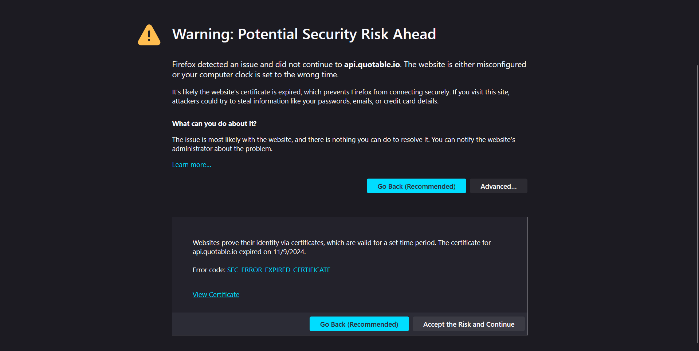
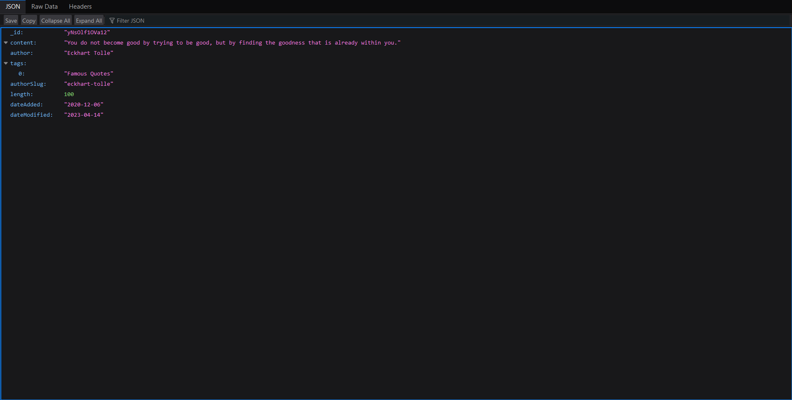

## Problem Addresal

If you are using this extension you might see some error occurred instead of quote
This is because the API being used for fetching the quote doesn't follow HTTPS protocol instead it does use HTTP so browser is blocking the request

## Fix:

Either allow even HTTP request (not recommended) 😅 or https://api.quotable.io/random
run this URL once it will warn you but you can accept and continue after that extension should work fine

Thanks @shivs3114 for pointing it out
